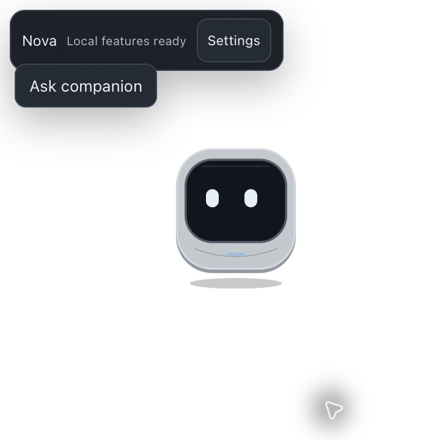
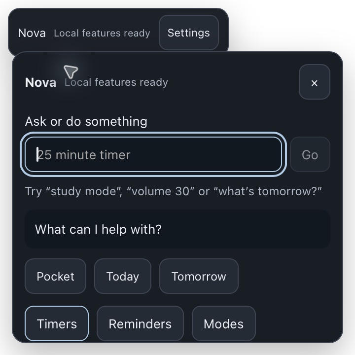
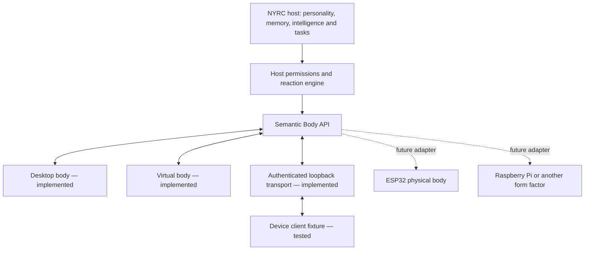

<div align="center">


# NYRC

### Not Your Regular Companion

**A little presence. A serious assistant. Built for your desktop today — and real hardware tomorrow.**

NYRC is a local-first intelligent personal companion designed to stay useful, expressive and personal without depending on the cloud.

**Useful when you need him. Alive when you don't.**

Local first · AI optional · Designed for hardware · Open source

[Meet NYRC](#meet-nyrc) · [Hardware](#one-brain-many-bodies) · [Capabilities](#everything-in-one-companion) · [Get started](#get-started) · [Release status](#release-status)

</div>

<p align="center">
  
  
</p>

<p align="center"><em>Meet your companion. Ask for what you need. Get back to your day.</em></p>

## Meet NYRC

NYRC starts with a presence. A small expressive companion lives beside your work: it can think, wait, celebrate, sleep and react to events. When you need something, the same companion becomes an assistant for timers, reminders, saved information, routines and optional AI conversation.

Its behavior and everyday tools keep working with AI off. Personality, memory, tools, permissions and presentation are separate systems, so changing the intelligence provider does not replace the companion.

**The intelligence provider can change. The companion does not.**

## One brain. Many bodies.

Hardware is part of NYRC's product direction from the beginning. The desktop character is the first body for a companion designed to extend into a physical desk device, a compact OLED companion or another form factor.

The host owns memory, personality, intelligence, tasks, scheduling and permissions. A body handles presentation and interaction. The same semantic contract lets a desktop face, virtual device and future hardware adapter respond to the same companion state.



### A small device, backed by a capable host

An ESP32-class body does not need to run the entire AI stack. The intended design keeps demanding work on the host while the device draws its face, plays cached animations and reports interactions.

| Host responsibility | Physical body concept |
|---|---|
| Memory, reminders, Pocket and integrations | Display, expressive eyes and local animations |
| Optional local or cloud AI | Touch, buttons and IMU gestures |
| Personality and semantic reactions | LEDs, brightness and haptic feedback |
| Task execution and permission decisions | Battery status and device power management |

For example, a completed timer becomes an attentive reaction. The desktop can animate its face; a future OLED body could show compact eyes and a status light. The core sends meaning, and each body renders what its capabilities support.

Device disconnection leaves the host companion and local tools running. Devices report capabilities; they cannot approve permissions, execute arbitrary host actions or access the host database.

### What you can develop today

The RC includes desktop and virtual bodies, a versioned Body API, an authenticated **loopback-only** TCP transport and a device-client fixture. The protocol covers pairing, capability negotiation, message IDs, ACKs, heartbeats, bounded frames, deduplication, reconnect and state resynchronization.

Open **Settings → Advanced → Platform & body diagnostics** to use the virtual simulator and pairing tools. Simulate touch, shake, pickup, low battery, disconnect/reconnect and device sleep/wake, then inspect outbound expressions, animations, text, brightness and haptics. **Settings → Devices** shows body connection status.

Start the loopback transport, then run the fixture from the repository:

```sh
node tools/body-client.mjs <port>
```

Enter the displayed session token when prompted. No physical device or firmware toolchain is needed to exercise the contract.

**Physical hardware remains the next step.** ESP32 firmware, Raspberry Pi drivers and BLE/LAN adapters are future integrations; this RC does not ship a validated physical device. Loopback binds to `127.0.0.1`, so a networked microcontroller needs an additional paired, protected adapter or bridge. Voice-event and speech-request fields are placeholders, not implemented voice recognition or synthesis.

Read the [Body protocol](docs/BODY-PROTOCOL.md) for exact messages, capability limits, security boundaries and reconnect behavior.

## Everything in one companion

| Capability | What it brings to your day |
|---|---|
| **Timers & reminders** | Session timers, durable reminders, alarms and important dates, with restart and overdue-item recovery |
| **Pocket** | A local tray for text, links, clipboard content and supported small files |
| **Aliases & modes** | Saved shortcuts and routines, resolved locally; unavailable actions report honest partial results |
| **Optional intelligence** | Local Ollama, OpenAI-compatible APIs or Gemini through a provider-independent layer |
| **Google Calendar** | Optional event reads and proposed create/update/delete actions, with confirmation for changes |
| **Desktop integration** | Notifications, clipboard, secure credentials and supported host controls; availability varies by platform |
| **Developer events** | An opt-in local bridge for task, build, test and agent-status reactions |
| **Body development** | Virtual-device testing and a shared contract for future physical companions |

Open **Ask NYRC** and try:

```text
time
timer 25 minutes
remind me in 20 minutes to submit assignment
list reminders
study mode
open youtube
```

Simple requests resolve through local routing and saved aliases/modes before AI is considered. AI can propose a validated supported action; task execution still follows host permission policy. Timers are session-only. Reminders, Pocket, aliases, modes, memories and settings persist locally.

See [assistant and integration setup](docs/V1-ASSISTANT.md) and the [platform capability matrix](docs/PLATFORMS.md). Live cloud/Google acceptance requires real credentials and account consent.

## Personality stays with NYRC

Choose warmth, humor, verbosity, initiative, expressiveness, formality and playfulness independently of the provider. NYRC's character communicates thinking, attention, success, waiting, concern and sleep through its original visual identity.

Estimated user-state signals can inform quieter or calmer presentation. They are non-medical hints and never authorize sensitive actions. The shared semantic layer is designed to carry this character into other bodies.

## Security by design

**Intelligence can suggest. Authority stays with the host.**

- **Explicit permission.** Sensitive operations require native confirmation. Allow once applies to the approved action; Enter denies and Escape cancels.
- **Typed actions.** Unknown actions and malformed payloads are rejected. There is no generic AI-to-shell execution path.
- **Bounded file access.** Pocket and exports use a restricted local home with traversal, symlink and size checks.
- **Protected credentials.** Keys and Calendar secrets use macOS Keychain, Windows Credential Manager or Linux Secret Service, with no plaintext fallback.
- **Untrusted bodies.** Device capabilities describe presentation and input, never host authority. The opt-in development transport requires pairing and limits clients, frames and event rates.

Hardening tests cover concurrent scheduler claims, migration safety, provider failures and redaction, immutable approvals, hostile Body frames and reconnect/lifecycle stress. See [SECURITY.md](SECURITY.md) and the [dependency security review](docs/DEPENDENCY-SECURITY.md).

## Private by architecture

No mandatory NYRC account, advertising telemetry, automatic cloud sync or continuous clipboard monitoring. Local-only mode blocks cloud AI and Calendar requests. Enabling an external integration sends the data needed for that integration to the provider you configure; the [privacy policy](PRIVACY.md) explains those boundaries.

Durable state lives in the local `nyrc` home. Settings exposes memory export and credential removal. Quit before backing up the entire home; reinstall/uninstall does not intentionally erase your data. The [storage and migration guide](docs/STORAGE-MIGRATION.md) covers locations, safe migration, backup and reset.

## Get started

**Current candidate: `1.0.0-rc.1`.** Download the matching package from the [verified four-target CI run](https://github.com/akilanpl/NotYourRegularCompanian-NYRC-/actions/runs/37330186142); GitHub may require sign-in for artifacts. Verify the accompanying SHA-256 manifest. Checksums establish integrity, not trusted publisher identity.

| Platform | Package | Current acceptance |
|---|---|---|
| macOS Apple silicon | ARM64 App ZIP | Native core installation/restart flows passed |
| macOS Intel | x64 App ZIP | Build/tests passed; desktop acceptance external |
| Windows x64 | NSIS EXE | Build/tests passed; desktop acceptance external |
| Debian / Ubuntu x64 | DEB | Build/tests passed; desktop acceptance external |

On macOS, unzip and copy `NYRC.app` to Applications. On Windows, run the NSIS installer. On Debian/Ubuntu, install the DEB with your package manager. These are unsigned candidates; publisher warnings may appear, and macOS notarization is not claimed. See [platform requirements](docs/PLATFORMS.md) and [release instructions](docs/RELEASE.md).

At first launch, name your companion and choose local-only mode to start without an API key. Try a timer, save something in Pocket, then configure personality, optional AI or Calendar in Settings. Explore the Body simulator when you want to start building beyond the desktop.

### Build it yourself

Use Node **22.12+**, Rust **1.89+** and your platform's [Tauri prerequisites](https://v2.tauri.app/start/prerequisites/).

```sh
git clone https://github.com/akilanpl/NotYourRegularCompanian-NYRC-.git
cd NotYourRegularCompanian-NYRC-
git checkout v1-completion
npm ci
npm run tauri:dev
```

Build a packaged candidate:

```sh
npm run tauri:build -- --ci -- --locked
```

The RC currently lives on `v1-completion`; use the published release ref when one is available. Read [CONTRIBUTING.md](CONTRIBUTING.md) for development checks and fixtures.

## Release status

The RC passed **452 frontend tests**, **five release-tooling tests** and **143 Rust tests on macOS/Linux or 136 on Windows**. Svelte checking reported zero errors/warnings. CI builds four native targets and checks version agreement, executable architecture, private paths, package contents and checksums.

Dependency audits reported zero vulnerabilities, with a narrowly reviewed Linux glib soundness advisory and maintenance notices retained. Native validation covered ARM64 onboarding, reminders/Pocket across restart, upgrade, reinstall and backup/reset/restore.

External acceptance remains for trusted Apple/Windows signing, live cloud/Google accounts, physical ESP32 hardware, Intel/Windows/Linux desktop environments, actual OS sleep/wake and mixed-DPI monitor hardware. The release workflow also needs default-branch registration and protected publication configuration after approved merge. A stable `v1.0.0` release has not been published.

The [release scorecard](docs/PROMPT5-RELEASE.md) records evidence and practical limits. Short resource samples are not long-term battery-life or leak-free guarantees.

## Explore further

| Guide | Purpose |
|---|---|
| [Body protocol](docs/BODY-PROTOCOL.md) | Hardware contract, transport, fixtures and future adapters |
| [Architecture](docs/ARCHITECTURE.md) | Companion simulation, native services and data flow |
| [Assistant & providers](docs/V1-ASSISTANT.md) | Commands, AI and Calendar configuration |
| [Storage & migration](docs/STORAGE-MIGRATION.md) | Persistence, upgrade, backup and reset |
| [Release engineering](docs/RELEASE.md) | Packaging, signing and controlled publication |
| [Changelog](CHANGELOG.md) | Release-candidate changes |

NYRC is distributed under the [MIT license](LICENSE), with required attribution in [third-party notices](THIRD_PARTY_NOTICES.md).

<div align="center">

**One companion brain. Different bodies.**

Same personality. Shared host memory and tools. A new way to be present.

**Built local first. Designed to become physical.**

</div>
