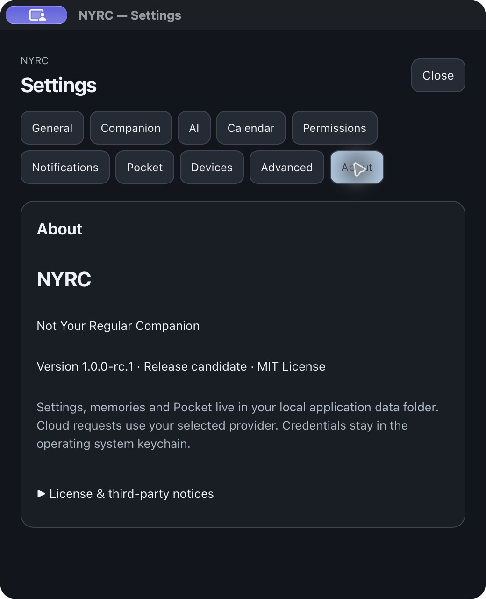
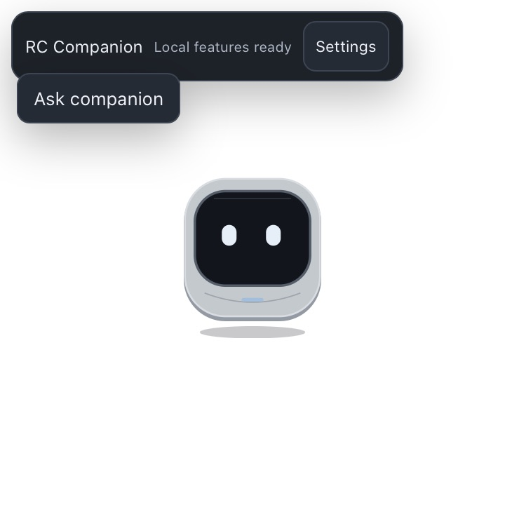

# NYRC 1.0.0-rc.1 release validation

Prompt 5 completes the unsigned release-candidate engineering scope. Stable publication, merge and a v1.0.0 tag are not performed. The readiness table distinguishes tested behavior from compiled packages and unavailable external acceptance.

## Readiness scorecard

| Area | Result | Evidence / practical limit |
|---|---|---|
| Version, About, diagnostics | PASS | npm/Tauri/Cargo/lockfiles agree; native About says 1.0.0-rc.1 / Release candidate |
| Frontend quality | PASS | 452 tests / 41 files; Svelte 0 errors, 0 warnings; production build |
| Rust and security regressions | PASS | 143 macOS tests, including full pre-v1 fixture upgrade/reopen/deadline jump; locked build |
| Release tooling | PASS | Four Node release tests; actionlint 1.7.12; version drift/tag/CRLF and architecture mismatch fail closed |
| Clean macOS build | PASS | Fresh clone, npm ci, fresh Cargo target, tests and ARM64 App bundle; no copied node_modules/dist/target |
| macOS ARM64 native install | PASS | Isolated packaged install, onboarding/local-only, timer, reminder, Pocket, quit/relaunch |
| macOS Intel | PASS — BUILD ONLY | Native runner tests and App ZIP; no Intel desktop UX acceptance |
| Windows x64 | PASS — BUILD ONLY | Native runner tests and NSIS EXE; no Windows desktop install/tray/notification acceptance |
| Linux x64 | PASS — BUILD ONLY | Native runner tests and DEB; no Linux desktop GUI acceptance |
| Upgrade/reinstall/backup/reset | PASS | 0.2.0 → RC fixture retains data; same-version replacement; quit/move/restore home checked byte-for-byte |
| Single instance | PASS | Second same-home install shows safe startup failure; no second services; DB lock regression |
| Sleep/wake recovery | PASS | Deterministic no-poll deadline jump claims once and survives restart; native overdue restart; actual system sleep not exercised |
| Body lifecycle/resources | PASS | Five native reconnect/shake cycles, 200 virtual cycles and bounded real TCP tests; stable descriptors |
| CPU/RSS profiling | PASS | Direct resident-size samples, Activity Monitor CPU/energy; limited interaction sample, no long soak claim |
| Dependency audit | PASS | npm 0 vulnerabilities; Rust 0 vulnerabilities; exact reviewed Linux glib warning remains visible |
| Identity/legal/privacy/docs | PASS | Original NYRC SVG/icons; active identity/path scan; packaged license/notices read natively |
| Trusted publisher signing | EXTERNAL VALIDATION REQUIRED | Apple Developer ID/notarization and Windows certificate unavailable |
| Live cloud and Google Calendar | EXTERNAL VALIDATION REQUIRED | Real credentials/accounts/consent unavailable; disconnected and mock transport tested |
| Physical ESP32 | EXTERNAL VALIDATION REQUIRED | No physical device; protocol/virtual/TCP fixtures tested |
| Release dispatch/publication | EXTERNAL VALIDATION REQUIRED | GitHub requires new workflow on default branch; approved merge/default-branch registration required before dry-run dispatch |

## CI and source provenance

[Four-target CI run](https://github.com/akilanpl/NotYourRegularCompanian-NYRC-/actions/runs/37326151336) exercises the shared native workflow at `d786209d003186418b04eed35439cf11dd60b2d0`. Each target passed its tests, packaging, checksum generation and upload. Final PR-head checks must also be green before merge; use the PR checks and artifact metadata as the authority for its exact head SHA. The final head additionally fixes mixed-DPI adjacency with four regression cases; final-head CI/artifacts are the authority for that correction.

Native tests vary by OS because Unix-specific jail/permission tests are cfg-gated. The final local suite is 143 tests; the CI artifact-producing run predates the additional upgrade/deadline-jump regression by one test. This is disclosed instead of inventing equal test totals on all platforms.

First clean clone at release version passed 448 frontend and 142 Rust tests and built ARM64. A second fresh clone at `522e2d211b60d424876c43348a0ca8715350817b` independently installed locked dependencies, passed check/tests and built the final runtime including memory export and Calendar controls. No build outputs were copied into either clone. Registry/download caches were reused. Logs and artifact manifests are retained with the local output report.

`npm run tauri:dev` was attempted and compiled/launched, but the shell-launched process could not establish macOS WindowServer/XPC services. All visual/native acceptance above was performed through the packaged app via computer-use controls. This is packaged native evidence, not a claimed successful dev-window smoke test.

## Fresh native installation and data lifecycle

The packaged app was copied into an isolated Applications directory with an explicit separate NYRC_HOME. No source-tree runtime files or development storage were used. Fresh onboarding appeared; name `RC Companion` and local-only mode were saved. A 10-second timer completed. A one-minute durable reminder and `RC Pocket` text entry were created. Quit occurred before the reminder deadline. Relaunch restored name/settings and Pocket, and presented the overdue reminder. SQLite retained one durable reminder row rather than creating a duplicate. Triggered items remain available until dismissal; exactly-once claims do not promise exactly-once OS delivery.

For upgrade, the prior 0.2.0 packaged build was launched against a disposable state containing Pocket, reminders, aliases, modes, settings, companion name, public provider/Calendar references and a migration marker. It showed Version 0.2.0. After quitting, its binaries were replaced with RC and relaunched. The fixture tables compared equal, schema remained 1 and integrity_check returned ok. The new Rust regression additionally exercises a version-0 schema missing last_report_at, verifies three upgrade/reinstall opens, and jumps from before deadline to forty minutes overdue: one claim, no repeat, triggered state recovered after reopen.

Reinstalling RC over RC did not repeat onboarding or change those persisted tables. Moving the closed app out of Applications left every local-home file unchanged. Moving the closed home aside produced first-run onboarding; restoring the entire backed-up home reproduced every file byte-for-byte. No production data or credentials were deleted. Full credential removal is exposed in Settings, with Calendar cancellation verified; live credential-store removal is not asserted without real entries.

A second uniquely registered app with the same fixture home showed “Couldn’t prepare local storage” and retained data, consistent with the instance lock. It does not silently activate the first window. The second process was closed; existing reminder rows and DB integrity were retained.

For reliable native automation only, fixture copies had distinct LaunchServices names/IDs, NYRC_HOME environment metadata and an ad hoc signature. The distributable keeps `com.nyrc.companion`. All 29 nonempty executable Mach-O sections in both fixture copies matched the unmodified local archive. Full binary hashes differ after signing; executable code equivalence is recorded separately.

## Resources and sleep

macOS libproc PROC_PIDTASKINFO supplied resident bytes, thread count and descriptor count. CPU deltas used Mach timebase conversion; Activity Monitor corroborated CPU and supplied an energy-impact sample. Initial zero-byte Activity Monitor observations were discarded. Memory footprint shown by Activity Monitor is not substituted for RSS.

| Final packaged main-process case | RSS MiB | CPU % (short sample) | Threads | Descriptors |
|---|---:|---:|---:|---:|
| Startup/settling | 90.06 | 0.13 | 20 | 16 |
| Settings/export interactions | 108.12 | 2.87 | 19 | 16 |
| Five virtual reconnect cycles | 99.33 | 2.79 | 18 | 16 |
| Settled visible idle | 95.66 | 2.47 | 20 | 16 |
| Five assistant/Time/Pocket cycles | 103.95 | 6.81 | 20 | 16 |
| Hidden/background | 113.64 | 0.26 | 19 | 16 |
| Verified sleeping fixture | 109.30 | 0.10 | 26 | 16 |

Samples are approximately three seconds and include normal UI/reaction transitions. Web content, GPU and networking subprocesses were measured separately in raw JSON; their memory is additional and shared pages should not be treated as unique aggregate allocation. Native descriptors stayed 16 and threads remained bounded; retained memory varied with UI/cache warmup instead of growing on each reconnect. This small run does not establish a long-term leak-free guarantee. Activity Monitor energy impact for the active fixture was 10.1 in one sample; it is an OS indicator, not watts or a battery-life measurement. No power-meter claim is made.

Actual machine sleep was not forced. A targeted simulated process suspension was rejected by the sandbox before any process was stopped. Deterministic deadline-jump/restart tests cover overdue scheduling without polls; virtual reconnect tests cover listener/session cleanup. Actual system power-state and physical-device reconnection remain native-environment acceptance.

## Security, identity and packaged contents

All existing Prompt 4 security tests were rerun: no-follow jail, migration failure safety, SQLite contention/claim races, TaskManager approval/cancellation, provider generations/redaction/response bounds, bounded queues and Body fuzz/timeout cleanup. Memory export and Calendar configure/disconnect now also pass native confirmation. In the final app, Enter denied memory export; explicit Allow once wrote JSON inside the fixture exports directory; Escape canceled Calendar disconnect.

npm audit reports zero vulnerabilities. cargo-audit reports zero vulnerabilities and visible informational warnings. glib 0.18.5 / RUSTSEC-2024-0429 remains a reviewed unsound Linux transitive API: all 586 locked packages were source-scanned, finding no callers of VariantStrIter/array_iter_str outside glib itself. Only this exact advisory/package/version is permitted; new vulnerabilities or soundness warnings fail. See DEPENDENCY-SECURITY.md for the chain and fixed-version constraints. Maintenance notices are retained, not erased.

The final documentation audit found and fixed the historical mixed-DPI roaming defect: adjacency/overlap now use physical coordinates, with target-scale landing conversion. Four cases failed before the fix and pass afterward. Real mixed-DPI desktop acceptance requires additional monitor hardware.

Active source/product metadata is NYRC. Historical donor references remain only in isolated migration compatibility and legal attribution; the remote repository's historical spelling remains unchanged. Frontend source maps are disabled. Release builds remap source/home paths; scanners inspect packages and the raw executable for private paths/credential-shaped data. Artifact names are additionally checked against Mach-O/PE/ELF executable headers. LICENSE and THIRD_PARTY_NOTICES exist in the package and were readable from About.

## Artifacts and distribution state

Packages are named `NYRC-1.0.0-rc.1-macOS-arm64-unsigned.zip`, `NYRC-1.0.0-rc.1-macOS-x64-unsigned.zip`, `NYRC-1.0.0-rc.1-Windows-x64-unsigned.exe`, and `NYRC-1.0.0-rc.1-Linux-x64-unsigned.deb`. Per-target metadata gives exact source SHA, target and signing state. SHA256SUMS accompanies each download; all downloaded package checksums are verified locally. The independently clean-built local ARM64 ZIP has SHA256 `87a00695698b129aaef2e189a048ce3838583707675084e88e1ff5962939968f` and source `522e2d2`. It is distinct from CI's build and has its own manifest.

No artifact is claimed trusted signed or notarized. Local macOS signature is linker/ad hoc, has no TeamIdentifier, and supplies no Gatekeeper notarization ticket. Optional Apple and Windows signing paths require real encrypted secrets and verification; they are documented but not exercised with fabricated credentials. Unsigned CI secrets must be unset, not empty strings: Tauri interprets present empty certificate variables as a signing request. This was reproduced and fixed.

Release workflow syntax passes actionlint. It runs quality/security/native validation, builds only selected actual targets, retains checksums/provenance and can only create a deliberately requested draft release on a version tag. An attempted `publish=false, signing=false` dispatch received GitHub 404 because release.yml is not on main. No merge or fake tag was used to bypass that restriction. After an approved merge, run the documented unsigned dry run, then configure environment approval/signing before trusted publication.

## Remaining external acceptance

Real Apple/Windows signing credentials; live cloud keys and Google OAuth/account consent; physical ESP32; Intel/Windows/Linux native desktop environments; actual OS sleep/wake; and default-branch registration of the new release workflow after approved merge. These are availability/acceptance constraints. They are not claims of tested behavior and do not become an unfinished internal feature list. The RC is suitable for review as an unsigned candidate; stable trusted public distribution still needs that external acceptance and human publication approval.
