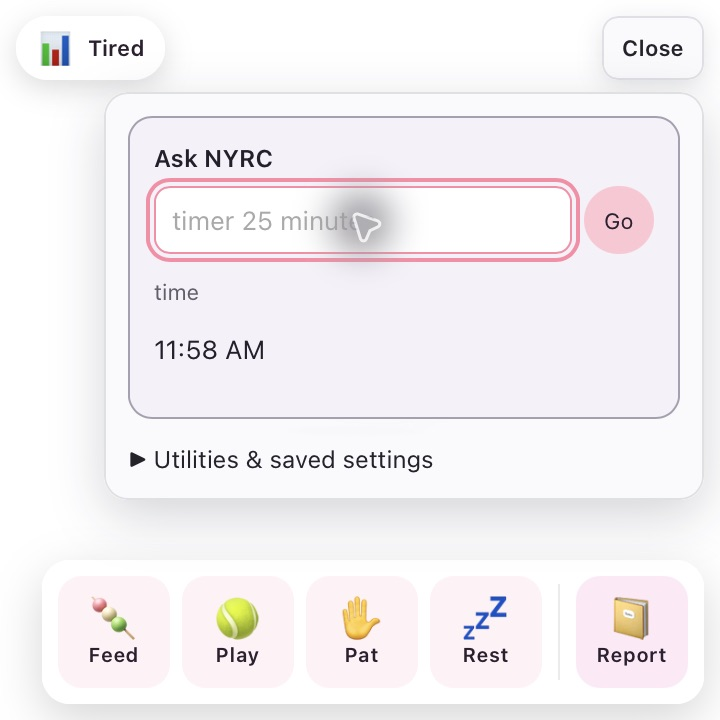

# NYRC unified assistant (Prompt 1)

Click **Ask NYRC**. Commands use deterministic parsing before any AI request; saved aliases and modes resolve locally. Extra utility controls are under **Utilities & saved settings**. Route provenance is visible only in development builds.

Try `time`, `timer 25 minutes`, `start a timer for 10 minutes`, `cancel my timer`, `cancel tea timer`, `volume 30`, `volume up`, `mute`, `open youtube`, `open my editor` (saved alias), `study mode`, `remind me in 20 minutes to submit assignment`, `remind me at 8 pm to call home`, `my birthday is March 12`, `remind me every year on October 5`, `list reminders`, `list alarms`, and `cancel reminder submit assignment`.

The router interprets simple clock times in the device's local timezone, rolling past times to tomorrow. It asks for clarification when cancellation is ambiguous. Timers remain session-only; reminders and important dates retain the existing durable scheduler and exactly-once claiming.

## AI setup

1. Open Settings → General. Choose Ollama, OpenAI-compatible, Gemini, or None.
2. For Ollama, run your local server and enter its endpoint and installed model. Cloud access stays blocked in local-only mode.
3. For OpenAI-compatible, enter the API base URL (for example `https://api.openai.com/v1`) and a model your account supports. Gemini uses `https://generativelanguage.googleapis.com/v1beta`; enter an available Gemini model name.
4. For cloud use, turn off local-only mode. Enter a provider key, then click **Save key**. Keys are write-only and stored in the native OS credential store; OpenAI-compatible and Gemini keys have separate references. There is no plaintext fallback.
5. Click **Save configuration & test connection**. The test performs one small real request. It does not validate arbitrary action execution.

The keyring is macOS Keychain, Windows Credential Manager, or the Linux Secret Service. If no secure store is available, saving credentials fails safely. Existing plaintext `cloud_api_key` settings are migrated to the keyring before the old setting is deleted. Existing database backups may still contain old keys: rotate previously stored credentials and manage backups separately.

The shared identity and configurable personality dimensions remain NYRC-owned. AI output must be a validated reply or allowlisted action proposal. The model cannot choose permission levels. AI mutations require confirmation; unknown IDs, invalid payloads and dangerous URL schemes are rejected. There is no shell execution or model-produced OS command path. Response bytes, timeouts and redirects are bounded; provider errors exclude upstream bodies and credentials. Deterministic commands are free of AI calls, even when providers fail.

## Calendar setup

The production Google Calendar adapter supports list, get, create, update and delete, including timezones and all-day events. Cloud use is blocked in local-only mode. Reads do not prompt; creates/updates/deletes go through the task permission UI.

Until credentials are configured, Calendar reports a disconnected state. No live Google connection is claimed by the tests.

To connect with your Google OAuth credentials:

1. Create a Google Cloud project, enable Google Calendar API, and configure the OAuth consent screen for your account.
2. Create an OAuth client. Authorize the `https://www.googleapis.com/auth/calendar.events` scope with offline access to obtain a refresh token. One practical manual setup uses Google's OAuth Playground with **Use your own OAuth credentials**; its redirect URI is `https://developers.google.com/oauthplayground` and must be registered on a Web OAuth client.
3. In the Playground, authorize the scope, exchange the authorization code, and obtain your refresh token. Do not paste credentials into chat or commit them.
4. In NYRC Settings → Google Calendar, enter the client ID, client secret and refresh token. Use calendar ID `primary` or the exact calendar ID you own. Check Enable Google Calendar and **Save securely**.
5. Disable local-only mode and ask `what's on my calendar tomorrow?`. NYRC refreshes access tokens in Rust. Reconnect if authorization expires or Google revokes the refresh token.

The current setup uses manually provisioned OAuth refresh credentials; there is no embedded browser authorization wizard. Disconnect removes stored calendar credentials. Upcoming reminders and conflict checks use explicitly fetched calendar data and local timeouts, not AI polling. To refresh a changed remote calendar, ask NYRC to list it again. All-day date strings use the Calendar API's exclusive end-date convention.

Primary API references: [Google Calendar events](https://developers.google.com/workspace/calendar/api/v3/reference/events), [Gemini API](https://ai.google.dev/api), [OpenAI structured output](https://developers.openai.com/api/docs/guides/structured-outputs).

## Pocket and clipboard

Commands: `save text to pocket: a note`, `save https://example.com to pocket`, `show my pocket`, `get pocket <id>`, `delete pocket <id>`, `save file notes.md to pocket`, `export pocket <file-id>`, `copy hello to clipboard`, `read clipboard`, `save clipboard to pocket`.

Pocket uses its own additive SQLite table and UUID references, surviving restart. The default item limit is 256 KiB, configurable in Settings from 1 KiB to 1 MiB. File imports accept only existing regular files in NYRC’s controlled inbox, through a bounded no-follow sandbox reader. Absolute paths, traversal, symlinks and oversized files are rejected. Files are stored as UTF-8 or base64 blobs in SQLite; metadata records encoding and raw byte size. Binary retrieval uses `export pocket <id>` to create a new file in NYRC’s controlled exports directory, with a sanitized name and no overwrites. Listing returns metadata without content; retrieval returns content. URLs allow HTTP/HTTPS only, with no embedded credentials.

Clipboard reads always require **Allow once** and never run continuously. **Deny** terminates the task. Clipboard-to-Pocket is a local operation and never sends clipboard data to AI. Clipboard writing is an explicit command.

## Developer bridge

Enable **Developer event log** in Settings. It is off by default. The bridge watches the `developer-events` directory under NYRC's data home; on Unix the directory has owner-only permissions. It opens no network listener. Events are bounded to 4096 bytes, validated against a closed vocabulary, and deduplicated in SQLite by event ID. Message text has a 2000-byte limit. Unknown fields, action types and invalid timestamps are rejected. Events never authorize tasks or execute code. `developer.permission.required` is only an attention signal, never a remote approval mechanism.

Example, with `<NYRC-home>` replaced by your configured local data directory:

```sh
node tools/developer-event.mjs '<NYRC-home>' developer.tests.passed 'All tests passed'
node tools/developer-event.mjs '<NYRC-home>' developer.build.failed 'Type check failed in the latest build'
```

The default data directory uses the platform's local data directory plus `pet-mochi`. The `MOCHI_HOME` environment override remains supported. The helper writes via atomic rename. Events delivered while the app is stopped are not replayed at startup; status snapshots and deduplication survive restart. Source files are local and user-owned; no remote editor integration is assumed.

Semantic reactions: started → focused; successful tests/build/task → pleased/success; failed tests/build → concerned; waiting → waiting; permission required → attentive. Ask `what failed in the latest build` for the latest recorded build/test failure message.

## Estimated user state and adaptation

The pure scorer uses normalized 0–1 dimensions: valence, arousal, stress, focus, fatigue and engagement. Scores include confidence and explanatory factors. Live assistant signals include recent task results, active/dismissed reminders, session interactions, local hour and current mode. The scorer can also accept calendar workload. Manual commands `I feel tired`, `I feel focused`, `I feel calm` and `I feel busy` affect the current session only.

Estimates are not diagnoses or facts about the user's feelings. Fatigue shortens responses; focus suppresses nonessential developer messages, while critical completion/permission/reminder events still surface. No sensitive action uses inferred state. User-state history is intentionally not persisted. Personality settings are persisted separately from provider selection.

## Validation and remaining setup

The automated suite covers deterministic routing, time/duration parsing, aliases/modes, AI fallback/rejection, permission resume/deny, clipboard consent, personality/state, calendar CRUD mocks and proactive timeouts, Pocket restart/size/URL/traversal, developer validation and provider HTTP fake responses/errors.

Credential-dependent live checks remain: Gemini/OpenAI authentication and model availability, and Google Calendar authorized CRUD. Set up credentials above to run those checks. The final PR records build/test counts and the actual manual smoke results. Prompt 2 is not started by this implementation. Prompt 3's visual redesign remains separate, as requested.

### Prompt 1 validation result

- `npm run check`: 0 errors, 0 warnings.
- `npm test`: 360 passed across 33 test files.
- `npm run build`: passed.
- `cargo test --lib`: 106 passed.
- `cargo build`: passed.
- `git diff --check`: passed.
- `npm run tauri:dev`: launched; also built a debug macOS app bundle for native inspection.
- Native UI automation verified local time, timer creation/completion, volume read/set (restored the original volume), Focus mode's honest partial-success result, a command-created durable reminder firing, Pocket save/list/get and retrieval after app restart, provider configuration fields, AI-disabled clarification, clipboard consent/denial, and a synthetic developer build-failure event injected through the helper and retrieved through the command input. Temporary provider/developer settings were restored.
- Allow-once resumption, alias resolution, calendar mocks, binary import/export, traversal/symlink/size rejection and provider fake HTTP failures were tested automatically. No claim is made for live credentialed Google Calendar, Gemini or OpenAI calls. Native alias execution and native binary import/export were not smoke-tested.


